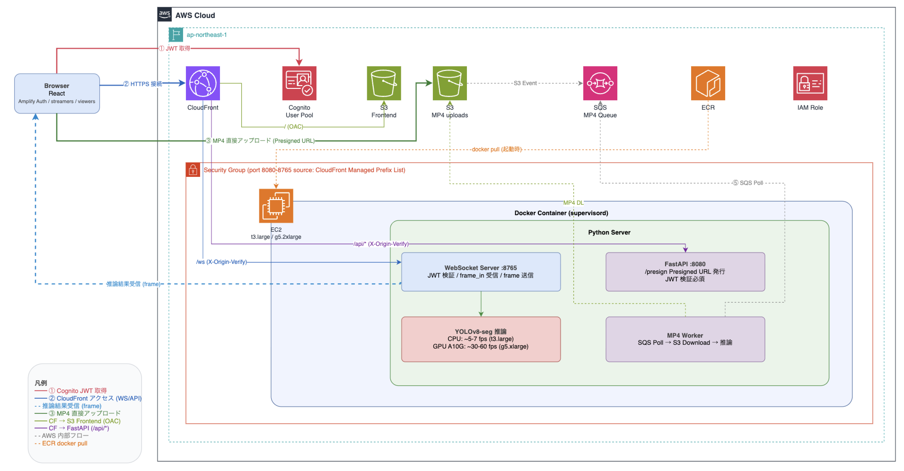

# aws-yolov8-realtime-segmentation

AWS 上でリアルタイム YOLOv8 インスタンスセグメンテーションを行うパイプライン。

**アーキテクチャ**



**Cognito グループ**

| グループ | 権限 |
|---------|------|
| `streamers` | カメラ配信・MP4 アップロード・WebSocket 送信 |
| `viewers` | 推論結果の視聴のみ |

## 前提条件

- AWS CLI 設定済み
- Node.js ≥ 20、pnpm
- Docker（ローカルの Mac/Linux: ECR へのビルド・push に必要）
- AWS CDK v2（`pnpm add -g aws-cdk`）

## セットアップ手順

### 1. インフラのデプロイ

```bash
git clone https://github.com/furuya02/aws-yolov8-realtime-segmentation.git
cd aws-yolov8-realtime-segmentation/cdk

pnpm install
pnpm cdk bootstrap
pnpm cdk deploy -c bucket_suffix=<任意のサフィックス>
```

`cdk deploy` で EC2・S3・CloudFront・Cognito・ECR・SQS のインフラが構築されます。  
この時点では ECR にイメージがないため、EC2 のコンテナ起動は自動的にスキップされます。

デプロイ後、以下の出力を控えてください：
- `CloudFrontUrl` — アクセス URL（例: `https://xxx.cloudfront.net`）
- `InstanceId` — EC2 インスタンス ID
- `EcrRepoUri` — ECR リポジトリ URI
- `FrontendBucketName` — フロントエンド用 S3 バケット
- `UserPoolId` — Cognito ユーザープール ID
- `UserPoolClientId` — Cognito アプリクライアント ID

### 2. Docker イメージのビルドと ECR への push

```bash
bash scripts/ecr_build_push.sh
```

このスクリプトがローカルでイメージをビルド → ECR に push → EC2 を再起動します。  
再起動後、`yolov8-seg.service`（systemd）が ECR から自動で pull してコンテナを起動します。  
コンテナが起動するまで約 3 分待ってください。

### 3. フロントエンドのデプロイ

```bash
bash scripts/deploy_frontend.sh
```

React アプリをビルド → S3 にアップロード → CloudFront のキャッシュを無効化します。

### 4. Cognito ユーザーの作成

**配信者（streamer）** の作成例：

```bash
POOL_ID=<UserPoolId>

aws cognito-idp admin-create-user \
  --user-pool-id $POOL_ID \
  --username streamer@example.com \
  --user-attributes Name=email,Value=streamer@example.com Name=email_verified,Value=true \
  --message-action SUPPRESS \
  --region ap-northeast-1

aws cognito-idp admin-set-user-password \
  --user-pool-id $POOL_ID \
  --username streamer@example.com \
  --password "YourPassword1!" \
  --permanent \
  --region ap-northeast-1

aws cognito-idp admin-add-user-to-group \
  --user-pool-id $POOL_ID \
  --username streamer@example.com \
  --group-name streamers \
  --region ap-northeast-1
```

**視聴者（viewer）** も同じ手順で `--group-name viewers` として作成します。

### 5. アプリを開く

ブラウザで `CloudFrontUrl` を開いてサインインします。

## 使い方

### ブラウザカメラ（配信者のみ）

配信者としてサインイン → カメラパネルが表示 → WebSocket 経由でフレームを EC2 に送信 → YOLOv8 推論結果がリアルタイムでブラウザに返ってきます。

### MP4 アップロード（配信者のみ）

**MP4 アップロード** セクションからファイルを選択します。
署名付き URL 経由で直接 S3 にアップロードされ、SQS → EC2 の順にバッチ処理されて推論結果が WebSocket で返ってきます。

## CPU / GPU 切り替え

既定は `t3.large`（CPU）です。GPU 推論に切り替えるには：

```bash
bash scripts/switch_to_gpu.sh   # g5.2xlarge に変更
bash scripts/switch_to_cpu.sh   # t3.large に戻す
```

インスタンスタイプ変更後、`yolov8-seg.service` が GPU の有無を自動判定してコンテナを再起動します。

## EC2 再起動後（IP アドレス変更への対応）

EC2 を再起動するたびにパブリック IP が変わります。以下を実行してください：

```bash
bash scripts/update_cloudfront_origin.sh
```

CloudFront のオリジンが新しい IP に更新されます。フロントエンドの URL（`CloudFrontUrl`）は変わりません。

## 後片付け（重要）

**使い終わったら必ず停止してください（t3.large: 約 $0.11/時、g5.2xlarge: 約 $1.21/時）。**

```bash
cd cdk
pnpm cdk destroy -c bucket_suffix=<任意のサフィックス>
```
